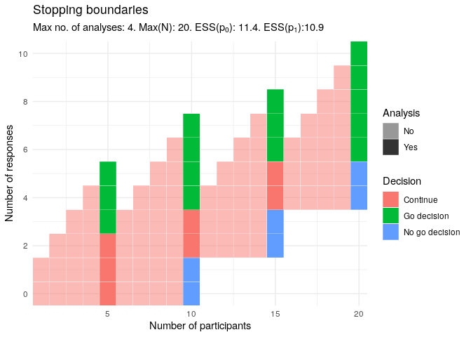

<!-- README.md is generated from README.Rmd. Please edit that file -->

# curtailment

<!-- badges: start -->
<!-- badges: end -->

The goal of curtailment is to allow users to create single- or two-arm
binary outcome clinical trial designs that use a form of early stopping
known as stochastic curtailment. Using stochastic curtailment can result
in trial designs with a lower sample size on average, compared to
typical trial designs or even multi-stage designs. The package contains
functions that will search for designs that are suitable for your trial,
and draw a diagram showing all points in the trial that a decision may
be made to stop early.

## Installation

You can install the released version of curtailment from
[CRAN](https://CRAN.R-project.org) with:

``` r
install.packages("curtailment")
```

And the development version from [GitHub](https://github.com/) with:

``` r
# install.packages("devtools")
devtools::install_github("martinlaw/curtailment")
```

## Example

This is a basic example which shows you how to solve a common problem:

``` r
library(curtailment)
## Find a single-arm design with a maximum sample size in the range 10-25, allowing early stopping after every 5 results, with a type-I error-rate of 0.05 when the response rate equals 0.1 and a power of 0.8 when the response rate equals 0.4:
output <- singlearmDesign(nmin = 10,
                          nmax = 25,
                          C = 5,
                          p0 = 0.1,
                          p1 = 0.4,
                          power = 0.8,
                          alpha = 0.05)
#>   |                                                                         |                                                                 |   0%  |                                                                         |====                                                             |   6%  |                                                                         |=======                                                          |  11%  |                                                                         |===========                                                      |  17%  |                                                                         |==============                                                   |  22%  |                                                                         |==================                                               |  28%  |                                                                         |======================                                           |  33%  |                                                                         |=========================                                        |  39%  |                                                                         |=============================                                    |  44%  |                                                                         |================================                                 |  50%  |                                                                         |====================================                             |  56%  |                                                                         |========================================                         |  61%  |                                                                         |===========================================                      |  67%  |                                                                         |===============================================                  |  72%  |                                                                         |===================================================              |  78%  |                                                                         |======================================================           |  83%  |                                                                         |==========================================================       |  89%  |                                                                         |=============================================================    |  94%  |                                                                         |=================================================================| 100%
# Obtain the stopping boundaries and a diagram of the above trial:
fig <- drawDiagram(output)
#>    n r C      alpha     power    EssH0      Ess    thetaF  thetaE eff.n
#> 1 20 5 5 0.02288714 0.8588104 11.37274 10.94708 0.3668967 0.92224    20
#>   stage
#> 1     4
#> [1] Returning diagram and bounds for single design.
```


